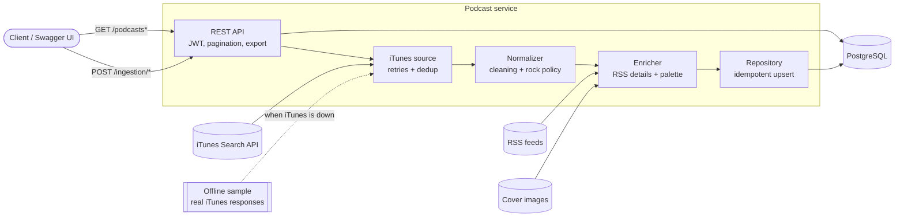

# Notes

How to run it, configure it and run the tests is in the [README](README.md). This file
covers the architecture, the decisions behind it, what I would do next, and how I would
take it to production.

## Architecture overview

The code follows a light **Domain-Driven Design** layering. Dependencies point inwards:

| Layer | Contents | Depends on |
|---|---|---|
| `domain` | `Podcast` aggregate, value objects (`ExternalRef`, `ColorPalette`), `PodcastNormalizer`, `RockRelevancePolicy`, ports (`PodcastRepository`, `PodcastSource`, `FeedReader`, `ImageFetcher`, `PaletteExtractor`) | standard library only |
| `application` | Use cases (`BulkIngestPodcasts`, `IngestSinglePodcast`, `ListPodcasts`, `GetPodcast`, `ExportPodcasts`, `IssueAccessToken`), `PodcastEnricher`, `UnitOfWork` port | domain |
| `infrastructure` | SQLAlchemy repository and unit of work, iTunes client and offline sample, RSS reader, image fetcher, Pillow palette extractor, PyJWT token service, retry policy | domain, application |
| `api` | FastAPI routers, request/response schemas, error handlers, auth dependency, exporters | application |

Each package declares its public API with `__all__`, and other packages import only
through it, so a package's internal modules can be reorganized freely. An architecture
test fails the build if a layer imports outward (e.g. `domain` importing
`infrastructure`) or reaches into another package's modules.

`container.py` (dependency-injector) is the composition root: the only place where a
port gets its concrete implementation. Tests use the same container and override
providers, for example to swap iTunes and the enricher for in-memory fakes.

### Data model

One table, `podcasts`:

| Column | Type | Notes |
|---|---|---|
| `id` | UUID | Primary key, generated on first insert. |
| `source`, `external_id` | text | **Unique together**: the natural key that makes ingestion idempotent. |
| `title`, `author` | text | Required. Trigram (GIN) indexes back the `q` search. |
| `description` | text | From the RSS feed (`itunes:summary`, else `<description>`), HTML stripped. |
| `language` | text | From the RSS feed, normalized (`en-us` → `en-US`). Indexed. |
| *(index)* | `(title, id)` | B-tree serving the catalog order: listing pages and the export cursor read it directly instead of sorting the table (0.2 ms for a page over 100k rows). |
| `genres` | text[] | iTunes genres minus the generic "Podcasts". GIN index. |
| `palette` | JSONB | Dominant cover colors, e.g. `["#1a1a1a", "#c0392b"]`, most dominant first. |
| `country`, `primary_genre`, `feed_url`, `store_url`, `cover_image_url`, `explicit`, `episode_count`, `released_at` | | As provided by iTunes, cleaned. |
| `created_at`, `updated_at` | timestamptz | `updated_at` only moves when data actually changes. |

### Request flow

**Bulk ingestion** (`POST /ingestion/bulk`):
1. The JWT is verified (`require_auth`).
2. `ITunesPodcastSource` searches each term, retrying transient failures. The same show
   often matches several terms, so results are deduplicated by iTunes id. If every term
   fails, the stored sample is served instead (`source: "fallback"`).
3. `PodcastNormalizer` cleans every record and skips unusable ones, with a reason.
4. `PodcastEnricher` fetches each podcast's RSS details and cover palette concurrently
   (8 at a time). Failures leave the podcast as it was and are only counted.
5. One transaction upserts everything, and the summary is returned. The slow network
   work happens *before* the transaction, so no connection is held while waiting on
   third parties.

**Queries** (`GET /podcasts`, `/podcasts/{id}`): the JWT is verified, the use case
opens a unit of work, and the repository runs one filtered, paginated query plus a
count. **Export** keeps the unit of work open while the response streams, and closes
it if the client disconnects.

## Decisions and trade-offs

### Storage: PostgreSQL

The data is small, structured records with a natural key, and the brief asks for
idempotency, filtering, pagination and exporting very large catalogs. PostgreSQL
covers all of it with one dependency:

- `INSERT … ON CONFLICT (source, external_id) DO UPDATE` makes idempotency a database
  guarantee, even with two ingestions running at the same time. A `WHERE … IS DISTINCT
  FROM` clause means identical data is reported as `unchanged` and never rewritten.
- `pg_trgm` indexes make `ILIKE '%term%'` search fast: 87 ms over 100k rows in my test.
- Server-side cursors let the export stream an arbitrarily large table in constant
  memory.
- Arrays (genres) and JSONB (palette) keep the schema to one table.

Alternatives I rejected:
- **SQLite:** simpler to run, but no real concurrency and weaker streaming.
- **A search engine (Elasticsearch/OpenSearch):** better relevance and fuzzy search,
  but it adds a second system to operate and keep in sync, which this scope doesn't
  need.
- **Files:** give no idempotent upsert or indexed filtering.

### Authentication: JWT (PyJWT) with a static client

`POST /auth/token` exchanges a single static client id/secret for a short-lived HS256
token. I used the OAuth2 password form so the **Authorize** button in `/docs` works.

- **Library:** PyJWT, not python-jose, which is unmaintained and has known
  vulnerabilities.
- **Verification is strict:**
  - The algorithm is pinned to HS256 and never read from the token, so `alg=none` and
    algorithm confusion are rejected.
  - `exp`, `iat`, `iss` and `sub` are required.
  - Credentials are compared in constant time.
- **Failures:** every auth failure is a `401` with `WWW-Authenticate: Bearer` in the
  common error shape.
- **Secrets are mandatory settings with minimum lengths:** the service refuses to start
  without them rather than falling back to a well-known default. The only defaults live
  in `docker-compose.yml`, clearly marked local-only.
- **Trade-off:** there is no refresh or revocation, so a leaked token stays valid until
  it expires (1 hour by default). An API key would have been simpler, but JWT gives
  expiry for free and fits a gateway or identity provider later.

### Data source: iTunes Search API, plus an offline sample

iTunes needs no API key. Its search results lack a description and language, so both
come from each podcast's RSS feed during enrichment.

`src/podcast_service/infrastructure/sources/itunes/data/itunes_search_sample.json`
holds real, unmodified iTunes responses for the six default terms, captured on
2026-09-26 (140 results). When every live search fails, bulk ingestion uses the sample
and says so in the summary. A single-podcast lookup also falls back to it, and returns
`503 source_unavailable` if the podcast isn't there.

### What counts as "rock & roll"

A podcast qualifies when **both** of these hold:
1. It is filed under an iTunes **music** genre (`Music`, `Music History`,
   `Music Commentary`, `Music Interviews`).
2. Its title, author or genres contain a rock keyword: `rock` (also inside compounds
   such as "HardRockCore", "ClassicRockHistory", "Hårdrock" or "Rocking", but never
   "rocket"), or the whole words `punk`, `grunge` or `metal`.

I tuned the rule against the real sample: **94 of 136** distinct results are kept.
Requiring a music genre is what filters out the noise iTunes returns for rock
searches, such as "Punk Rock Therapy" (mental health), "Hard Rock Crochet" (crafts)
and "Rock and Roll it" (cricket).

Known misses: music shows whose metadata never says "rock", such as *The Eddie Trunk
Podcast*. Using episode titles or the feed's categories would catch them, at the cost
of more requests and more false positives.

### Cleaning and validation rules

- **Text:** HTML tags removed (`<script>`/`<style>` content dropped), entities decoded
  (feeds are often double-escaped: `&amp;amp;` → `&`), whitespace collapsed. Anything
  left empty becomes null.
- **URLs:** only absolute `http(s)` URLs are kept.
- **Language:** normalized to a BCP-47-style tag; anything else is dropped.
- **Dates:** ISO-8601 (iTunes) and RFC 2822 (RSS) are accepted and stored in UTC.
  Unparseable dates become null.
- **Genres:** deduplicated case-insensitively, without the generic "Podcasts" genre.
- **Other fields:** negative episode counts become null. Values of the wrong type (for
  example `genres` as a string) are coerced to null by the source mapper, never
  crashing.
- **Skipped records:** a record is skipped, and listed in the summary with its reason,
  when it has no id (`missing_external_id`), no title (`missing_title`), no author
  (`missing_author`), is not rock (`not_rock_related`), or repeats an id already seen
  in the batch (`duplicate_in_batch`).
- **Re-ingestion:** the enrichment columns (description, language, palette) are
  merged with `COALESCE`. If a feed or cover is temporarily unreachable, the values
  stored by an earlier run are kept rather than erased.

### Cover image and color palette

The cover (`artworkUrl600`) is downloaded only if it is really an image and under a
5 MB cap. It is decoded into a 150 px thumbnail and quantized with Pillow's median cut
into up to 5 colors, ordered by the share of the image each covers. Two guards apply:
- The CPU work runs in a worker thread, off the event loop.
- A pixel limit protects against decompression bombs.

A missing or broken cover never fails an ingestion: the podcast is stored with
`palette: null` and counted in `palette_failures`.

### Resilience, where it is needed

- **Retries:** only for transient failures (timeouts, connection errors, 408, 425,
  429, 5xx), with exponential backoff and jitter, honouring `Retry-After`, capped at
  8 s. iTunes gets 3 attempts; feeds and covers get 2 because they are best effort.
  Client errors and malformed payloads fail fast.
- **Fallback and degradation:** the offline sample covers the source. Feeds and
  covers degrade gracefully.
- **Limits:** bounded enrichment concurrency (8), download size caps (2 MB feeds, of
  which only the header is needed; 5 MB covers) and timeouts on every call. Every
  feed/cover download also has a 30 s total deadline, retries included: httpx
  timeouts apply per network operation, so without it a server trickling bytes
  could stall a whole bulk ingestion.
- **Last line of defence:** each adapter degrades gracefully on its own, and the
  enricher also contains any unexpected exception per podcast, so one bad cover
  can never fail the batch.
- **Rate limiting on lookups:** a single-podcast lookup that is still rate-limited
  (429) after retries counts as "source unavailable" (fallback sample or `503`),
  never as "podcast not found".
- **No circuit breaker:** with synchronous, user-triggered ingestion it adds little.
  It becomes worth it once ingestion runs continuously (see below).

### Ingestion runs inside the request

A default bulk ingestion takes about 25 s (136 podcasts, their feeds and covers). That
is acceptable for an operator-triggered endpoint and keeps the design simple. Request
size is bounded (≤ 20 terms × ≤ 200 results).

The downside is that a client timeout doesn't cancel the work, and very large batches
would need a job model (`202 Accepted` plus a status resource). See the scaling
section below.

### Export

`GET /podcasts/export` streams NDJSON by default: one JSON object per line, easy to
process line by line. CSV is available with `?format=csv`: list fields are joined with
`|`, and cells starting with `= + - @` are prefixed with `'` so spreadsheets don't run
them as formulas.

Rows come from a server-side cursor in batches of 500 and are written in chunks of
200. Measured with 100k rows: **106 MB in about 9 s, with the API container steady at
about 70 MiB**.

Trade-off: once streaming has started, the status code is already `200`, so a database
error mid-export can only truncate the body. Snapshot exports to object storage (see
below) would fix that.

### Pagination

Pagination is offset based (`page`, `page_size` ≤ 100, with `total` and `total_pages`).
It is simple and fine for a catalog this size, but deep pages get slower and can shift
when data changes. `q` is a case-insensitive substring match and a blank `q` is
ignored. `genre` is an exact, case-sensitive match on the values the API returns: it
uses the GIN index, and case-insensitive matching would need a normalized copy of
the genres. I'd move to keyset (cursor) pagination on `(title, id)` first if the
catalog grew.

## Assumptions

- A single static API client is enough (the brief rules out user management).
- "Podcast id" in single ingestion means the iTunes collection id.
- The bulk `limit` means results **per search term** (it maps to iTunes' `limit`).
- Ingesting the same podcast from another source would create a separate record,
  because the natural key includes the source.

## Known risks

- **SSRF via feed and cover URLs.** Those URLs come from a third party (the podcast
  publisher, through iTunes), and the service fetches them and follows redirects.
  Only `http(s)` is allowed, downloads are size- and time-capped, and nothing
  fetched is ever returned to the caller except the derived palette and description.
  A crafted feed URL could still make the service reach internal addresses. In
  production I would send enrichment traffic through an egress proxy (or a network
  policy) that blocks private, loopback and metadata ranges, which is more robust
  than resolving and checking IPs in application code (DNS rebinding).
- **A single large transaction per bulk ingestion.** Enrichment happens before the
  transaction, but all upserts commit together; a database error on one row rolls
  back the batch (the data is validated first, so this is unlikely). Per-row
  savepoints, or batches of a few hundred, would isolate failures.

## What I would do with more time

- **Jobs for ingestion:** return `202` with a job id; run the work in a worker.
- **Enrichment efficiency:** conditional requests (`ETag` / `If-Modified-Since`) for
  feeds and covers, and skip palette extraction when the cover URL hasn't changed.
  Today every run downloads everything again.
- **Pagination and search:** keyset pagination, and a relevance-ordered search option
  (`pg_trgm` similarity or full-text search).
- **Observability:** structured JSON logs with request ids, and metrics (ingestion
  counts, upstream latency and errors).
- **Nice-to-haves from the brief I left out on purpose:**
  - A CI workflow that runs ruff, mypy and pytest.
  - Richer filtering (country, explicit, several genres).
  - Episode ingestion.
  - Rate limiting or caching of iTunes calls.

## Evolving to continuous ingestion and millions of episodes

The flow already splits into independent stages (discover → normalize → enrich →
store), so scaling it means putting queues between them rather than rewriting them:

- **Scheduling:** a scheduler (cron, or a Kubernetes CronJob) enqueues discovery work
  per term, genre or chart.
- **Workers:** consume the queue (SQS/Pub/Sub, or Postgres-based with `SKIP LOCKED`)
  and do fetch, normalize and upsert. Each podcast gets its own enrichment and
  episode-sync tasks, so a slow feed never blocks the batch. Upserts are already
  idempotent, so retries and duplicate messages are harmless.
- **Scheduling feeds by activity:** refresh them adaptively (daily shows hourly,
  dormant ones weekly) with conditional GETs, which remove most of the bandwidth.
- **Rate limits:** rate limiting per host, plus circuit breakers, keep us polite to
  iTunes and feed hosts.
- **Storage:** episodes live in their own table keyed by `(podcast_id, guid)`,
  partitioned by publication date. Millions of rows fit comfortably in PostgreSQL with
  keyset pagination.
  - Covers would be stored in object storage, keyed by content hash, so palettes are
    computed once per image.
  - Search at that scale would move to OpenSearch, fed by change data capture or an
    outbox table.
- **Exports:** become asynchronous snapshot files in object storage, served through
  signed URLs.

## Deploying to production

- **Runtime:** the same multi-stage Docker image (non-root user) on a managed container
  platform, such as AWS ECS Fargate, Google Cloud Run or Kubernetes, with at least two
  replicas behind a load balancer that terminates TLS.
  - `/health` serves as the readiness check.
  - Uvicorn would run with `--workers` sized to the CPU, instead of the single worker used locally.
- **Database:** managed PostgreSQL (RDS or Cloud SQL) with automated backups,
  point-in-time recovery and a connection pooler (PgBouncer or RDS Proxy) sized for the
  replicas.
- **Configuration and secrets:**
  - Plain settings are environment variables.
  - `JWT_SECRET` and `AUTH_CLIENT_SECRET` come from a secrets manager (AWS Secrets
    Manager, GCP Secret Manager) injected at runtime, never baked into images or
    compose files, and are rotated periodically.
  - In front of real clients, I'd replace the static client with an identity provider
    issuing the tokens, with the service only verifying them (RS256 with its public
    keys).
- **Shipping a new version:**
  - CI runs lint, types and tests, then builds and pushes an immutable image tagged with
    the commit SHA.
  - Migrations run once as a separate pre-deploy job (`alembic upgrade head`), not on
    every container start as the local Compose setup does, and are written to be
    backwards-compatible (expand, then contract).
  - The platform does a rolling or blue/green deploy gated on health checks, and
    rolling back means redeploying the previous tag.
- **Operations:** centralized logs, metrics and alerts on error rate, latency and
  ingestion failures.

## Use of AI tools

I used Claude Code as a pair programmer for scaffolding, boilerplate, test cases and
reviewing edge cases. I decided the architecture and the technical choices: DDD
layering, dependency injection, PyJWT, the test structure and conventions,
PostgreSQL, the rock definition and what to leave out of scope. I also made the
project work in small reviewed phases, one commit each.

Every change was run and verified locally: tests, strict type checks, and real runs
against iTunes and Docker, including the fallback and a 100k-row export. Several
bugs were found and fixed that way:
- JSONB storing JSON `null` instead of SQL `NULL`, which broke the merge on
  re-ingestion.
- HTML error pages being parsed as RSS feeds.
- Order-dependent test snapshots.
